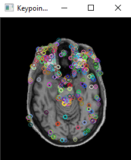

# Melanoma classification

Image classification task: malignant (1) / benign(0) for melanoma dataset (https://www.kaggle.com/c/siim-isic-melanoma-classification) using histograms.


I have converted each image to a chosen color space and I have calculated a histogram for each image in the training set.

```cpp
void CalculateHistogram(cv::Mat& src, cv::Mat& histogram)
{
    cv::Mat image;
    cv::cvtColor(src, image, cv::COLOR_BGR2HSV);

    int channels[] = { 0, 1, 2 };
    int histSize[] = { 256, 256, 256 };
    float sranges[] = { 0, 256 };
    const float* ranges[] = { sranges, sranges, sranges };

    cv::calcHist(&image, 1, channels, cv::Mat(), histogram, 3, histSize, ranges, true, true);
}
```

Then, I have summed up all histograms for malignant data to create one normalized malignant histogram and I have done the same with benign train data.

```cpp
cv::Mat SumMatrices(std::string path)
{
    cv::Mat sumhist;

    for (auto& entry : std::filesystem::recursive_directory_iterator(path))
    {
        std::filesystem::path file = entry.path();
        std::string path{ file.u8string() };

        cv::Mat src = cv::imread(path);

        cv::Mat hist;
        CalculateHistogram(src, hist);

        if (sumhist.empty())
            sumhist = hist;
        else
            cv::add(sumhist, hist, sumhist);
    }

    return sumhist;
}
```

After I had 2 summed histograms, one for benign and one for malignant data, I have calculated a histogram for each file in the test set and compared it with the two summed up ones. I have classified the data according to the correlation with the summed up histograms.
The class with higher correlation between the two histograms was assigned to the input data.

```cpp
std::unordered_map<std::string, bool> Correlate(std::string path, cv::Mat& negatives, cv::Mat& positives)
{
    std::unordered_map<std::string, bool> results;

    for (auto& entry : std::filesystem::recursive_directory_iterator(path))
    {
        std::filesystem::path file = entry.path();
        std::string path{ file.u8string() };

        cv::Mat src = cv::imread(path);

        cv::Mat hist;
        CalculateHistogram(src, hist);

        cv::normalize(hist, hist, 1.0, 0.0, cv::NORM_L1);

        if (cv::compareHist(hist, negatives, cv::HISTCMP_CORREL) > cv::compareHist(hist, positives, cv::HISTCMP_CORREL))
            results.emplace(path, 0);
        else
            results.emplace(path, 1);

        std::cout << path << " " << results.at(path) << std::endl;
    }

    return results;
}
```

In the image below, you can see the output of my program. It assigned a class to each input data and computed binary accuracy for the classification.


I have also played with hyperparameters and came to the following results:
1. I have achieved an accuracy of 46.1039% with 128 bins, 35.3896% 64 with bins, 45.7792% with 32 bins and 47.7273% with 16 bins (153/154 false positives, 8/154 false negatives) in HSV color space.
2. I have tried converting the images to different color spaces and achieved these results: 77.5974% for RGB and HSV, 76.9481% for CieLAB, 76.9481% CieXYZ.
3. Out of the histogram comparison metric (cv::HISTCMP_CORREL (77.5974%), cv::HISTCMP_CHISQR (62.013%), cv::HISTCMP_INTERSECT (76.9481%), cv::HISTCMP_BHATTACHARYYA (23.3766%), cv::HISTCMP_KL_DIV (23.0519%)), I have achieved the best results for HISTCMP_CORREL.

Overall, I achieved best results (77.5974% accuracy) with following hyperparameters:
HSV color space, 256 bins and HISTCMP_CORREL comparison metric.

# MRI 2D slice registration

2D MRI slices registration to baseline image using 2D features.

At first, I have chosen a template image as my baseline. Then, I have chosen another image and calculated their correlation using cv::matchTemplate function as you can see in the images below.


Then, I have detected and described keypoints using the ORB algorithm in both images and visualized them via cv::drawKeypoints 

```cpp
  auto detector = cv::ORB::create();

  std::vector<cv::KeyPoint> keypoints1, keypoints2;
  cv::Mat descriptors1, descriptors2;

  detector->detectAndCompute(tmplt, cv::Mat(), keypoints1, descriptors1);
  detector->detectAndCompute(image, cv::Mat(), keypoints2, descriptors2);

  cv::Mat img_keypoints1;
  cv::drawKeypoints(tmplt, keypoints1, img_keypoints1);

  cv::Mat img_keypoints2;
  cv::drawKeypoints(image, keypoints2, img_keypoints2);
``` 

The resulting visualization can be seen below.




I have then matched detected keypoints using brute force matching class (BFMatcher) and I have drawn the matches as seen in the image below.

```cpp
  cv::BFMatcher matcher(cv::NORM_HAMMING, true);

  std::vector<cv::DMatch> matches;

  matcher.match(descriptors1, descriptors2, matches, cv::Mat());

  cv::Mat viz;
  cv::drawMatches(tmplt, keypoints1, image, keypoints2, { matches }, viz);
```


I have computed the transformation matrix between matched points using cv::findHomography and the RANSAC method.

```cpp
  for (size_t i = 0; i < matches.size(); ++i)
  {
    obj.push_back(keypoints1[matches[i].queryIdx].pt);
    scene.push_back(keypoints2[matches[i].trainIdx].pt);
  }
  
	cv::Mat homography = cv::findHomography(scene, obj, cv::RANSAC);
```
 
 The final step was to transform the moving image using the transformation matrix (cv::warpPerspective). 
 I have visualizes the result in different color channels again and calculated a new value of the correlation coefficient (max value of minMaxLoc()).
 
 ```cpp
  cv::warpPerspective(image, image, homography, cv::Size(image.cols, image.rows));

  cv::Mat res;
  cv::matchTemplate(tmplt, image, res, cv::TM_CCORR_NORMED);

  double min, max;
  cv::Point min_loc, max_loc;
  cv::minMaxLoc(res, &min, &max, &min_loc, &max_loc);
 ```
 
 
